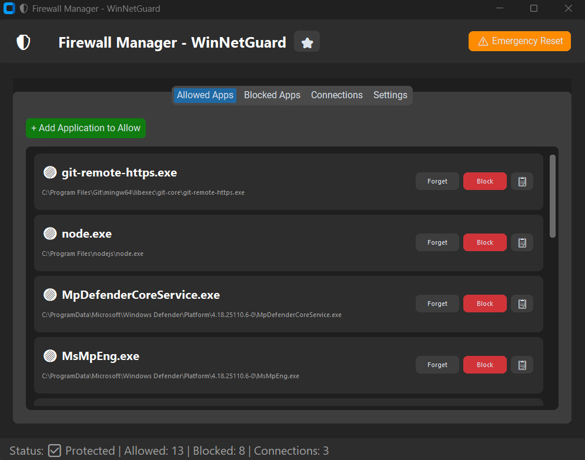
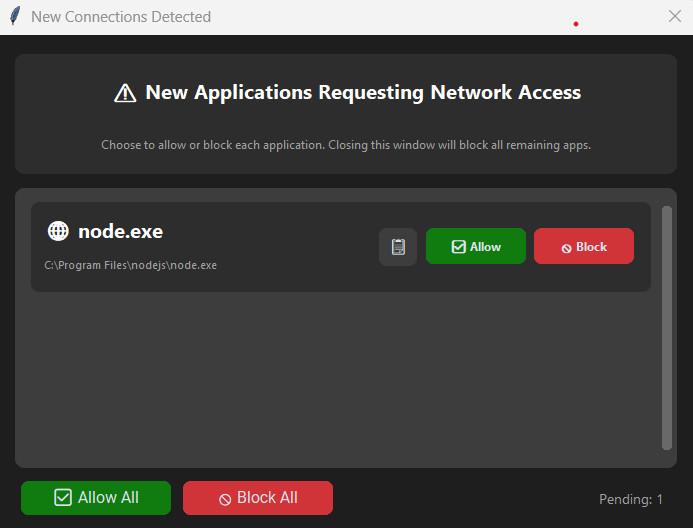

# WinNetGuard - Windows 11 Firewall Manager

Modern Windows Firewall manager with a clean CustomTkinter UI. Take control of which applications can access the internet with real-time monitoring and auto-blocking capabilities.

## What is this?

A user-friendly firewall manager (SimpleWall alternative) that sits on top of Windows Firewall, giving you granular control over application network access. Unlike Windows Firewall's complex interface, this tool provides:

- **Visual application management** - See all apps with network activity in one place
- **Auto-block new applications** - Unknown apps are blocked immediately when detected
- **Real-time connection monitoring** - Watch what's connecting to the internet right now
- **One-click allow/block** - No need to navigate Windows Firewall's complex UI
- **Safety-first design** - Built-in protection prevents breaking critical system services

Perfect for users who want to:
- Control which applications can access the internet
- Monitor network activity in real-time
- Block unwanted telemetry and background connections
- Improve privacy by limiting app internet access
- Learn which apps are "phoning home"

## Screenshots

<a href="screenshots/001.jpg" target="_blank">
  
</a>
<a href="screenshots/002.jpg" target="_blank">
  
</a>

## Key Features

✅ **Auto-Block New Apps** - All new applications blocked by default (when app is running)  
✅ **Startup Detection** - Scans for unknown apps on launch and shows approval dialog  
✅ **Single Instance** - Prevents multiple copies from running simultaneously  
✅ **Whitelist/Blacklist Management** - Easy allow/block with persistent rules  
✅ **Real-time Monitoring** - See active network connections mapped to processes  
✅ **System Tray** - Minimize to tray, monitoring continues in background  
✅ **Maximized Window** - Opens fullscreen by default for better visibility  
✅ **Autostart** - Run at login with admin privileges (no UAC prompt)  
✅ **Daily Logging** - Automatic logs in `logs/` directory  
✅ **No Console Window** - Clean launch with `pythonw.exe`  
✅ **Configurable Settings** - Font sizes, update intervals, connection limits  
✅ **Settings Auto-Restart** - Apply button automatically restarts app with new settings  
✅ **Safety First** - Built-in protection for critical system services  
✅ **Emergency Reset** - One-click removal of all app rules  
✅ **Copy to Clipboard** - Quick copy of app names and paths  

## How It Works

### The Security Model

**When the app is running:**
- New applications are detected and blocked immediately
- You get a notification dialog to allow or keep blocked
- Only whitelisted apps can connect without blocking
- Real-time monitoring shows all active connections

**When the app is closed:**
- No active protection - apps can connect freely
- Existing block rules remain in Windows Firewall
- Blocked apps stay blocked until you allow them

**Why no "strict mode"?**  
Windows Firewall doesn't support safe "block all except whitelist" rules. A global block would break DNS, DHCP, and system services, making your internet unusable. For maximum security, keep the app running (minimize to tray) and enable autostart.

### Safety Protection

The app prevents you from breaking your system:
- **DNS** (Port 53) - Required for internet connectivity
- **DHCP** (Ports 67/68) - Required for network configuration  
- **NTP** (Port 123) - Time synchronization
- **Critical Processes** - svchost.exe, lsass.exe, services.exe, etc.

All firewall rules use the `[WinNetGuard]` prefix, making them easy to identify and remove without affecting system rules.

## Requirements

- Windows 10/11
- Python 3.8+
- Administrator privileges (required for firewall management)

## Quick Start

### Installation

1. **Download or clone this repository**
2. **Double-click `setup.bat`** (creates virtual environment and installs dependencies)
3. **Double-click `run.bat`** to start the application

**Manual installation (alternative):**
```powershell
python -m venv .venv
.\.venv\Scripts\Activate.ps1
pip install -r requirements.txt
.\.venv\Scripts\python.exe main.py
```

### First Run Setup

1. **Add essential apps to whitelist** - browsers, email clients, system updates
2. **Configure settings** (Settings tab) - adjust font sizes and update intervals
3. **Optional: Setup autostart** - run `setup_autostart.bat` for protection at login

## Usage Guide

### Managing Applications

**Allowed Apps Tab:**
- Click "+ Add Application to Allow" to whitelist apps
- Whitelisted apps connect without blocking
- Move to blacklist or forget (remove from list)

**Blocked Apps Tab:**
- Click "+ Add Application to Block" to blacklist apps
- Blacklisted apps are blocked from internet access
- Move to whitelist or forget

**New App Detection:**
- New apps are blocked automatically when detected
- Dialog shows blocked apps (if notifications enabled)
- Click "Allow" to whitelist or "Block" to keep blocked
- Close dialog = all remaining apps stay blocked

### Connections Tab

Real-time network connection monitoring:
- 🟢 **Green** - Allowed connections (whitelisted apps)
- � **Red** - Blocked connections (blacklisted apps)
- Shows process name, path, remote IP:port
- 📋 Copy button - copies app name and path to clipboard

### Settings Tab

**Interface Font Size** (8-20)
- Base font size for UI elements

**Process List Font Size** (8-20)
- Font size for connections list

**Connection Update Interval** (1-10 sec)
- How often to refresh connections (higher = less CPU usage)

**Max Connections Display** (10-100)
- Limits memory usage for large connection lists

**Enable New App Notifications**
- Show dialog when new apps are blocked
- Disable for silent blocking

**Apply & Restart Required**
- Saves settings and automatically restarts application
- Required for font size changes to take full effect

### System Tray

- Click X button → minimizes to tray (monitoring continues)
- Click tray icon → restores window (maximized)
- Right-click tray icon → Show / Exit menu
- Window always opens maximized for better visibility

### Startup Behavior

**On Launch:**
- Window opens maximized automatically
- After 2 seconds, scans for active connections from unknown apps
- Shows approval dialog if unknown apps detected (when notifications enabled)
- Only one instance can run at a time (prevents duplicates)

## Advanced Features

### Autostart with Admin Privileges

Run at login without UAC prompts:

1. Double-click `setup_autostart.bat`
2. Approve UAC prompt (one time only)
3. Task created in Task Scheduler

**How it works:**
- Creates scheduled task with "Run with highest privileges"
- Runs at login automatically
- No UAC prompt on startup
- App starts minimized to tray

**Remove autostart:**
- Double-click `remove_autostart.bat`

### Emergency Reset

If you need to restore normal network access:

1. Double-click `emergency_reset.bat`
2. Confirm removal
3. All app-created rules removed

**What it removes:**
- All block rules created by this app
- Whitelist/blacklist cleared

**What it preserves:**
- System firewall rules
- Other application rules
- Windows Firewall settings

## Troubleshooting

### "Administrator privileges required"
The app needs admin rights to manage firewall rules. Let the UAC prompt elevate automatically or setup autostart.

### "Firewall Manager is already running"
Only one instance can run at a time. Check system tray or taskbar for existing instance. If stuck, kill all Python processes:
```powershell
Get-Process python* | Stop-Process -Force
```

### "Failed to initialize firewall manager"
Ensure Windows Firewall service is running:
```powershell
Get-Service -Name mpssvc
```

### Application still has network access after blocking
- Check if rule appears in Windows Firewall (search for `[WinNetGuard]`)
- Some apps use system processes - these cannot be blocked for safety
- Try restarting the blocked application

### Lost internet access
Run `emergency_reset.bat` to remove all app rules. If that doesn't work, manually remove rules:
```powershell
Get-NetFirewallRule | Where-Object { $_.DisplayName -like "[WinNetGuard]*" } | Remove-NetFirewallRule
```

### Autostart not working
- Open Task Scheduler (`taskschd.msc`)
- Look for "FirewallManagerAutostart" task
- Check if task is enabled and configured correctly
- Run `setup_autostart.bat` again if needed

## Technical Details

### Architecture

**Firewall Management:**
- Uses Windows Firewall COM API (`HNetCfg.FwPolicy2`) via `pywin32`
- Creates outbound blocking rules for blocked apps
- Rules persist in Windows Firewall even when app is closed
- No "allow" rules - apps are allowed by absence of block rules

**Connection Monitoring:**
- Uses `psutil` to track TCP/UDP connections
- Background daemon thread updates at configurable interval
- Maps connections to process names and paths
- Detects new applications and blocks them immediately

**Safety Checks:**
- Validates all block requests against core whitelist
- Prevents blocking of critical system services
- Ensures system stability and internet connectivity

### File Structure

```
├── main.py                    # Entry point with admin check
├── gui.py                     # CustomTkinter interface
├── firewall_manager.py        # Windows Firewall COM API wrapper
├── monitor.py                 # Network connection monitoring
├── safety.py                  # Core whitelist and safety checks
├── app_registry.py            # Whitelist/blacklist persistence
├── config.py                  # Constants and settings
├── logger.py                  # Daily logging system
├── requirements.txt           # Python dependencies
│
├── run.bat                    # Quick launch (no console window)
├── setup.bat                  # One-time setup script
├── emergency_reset.bat        # Emergency reset launcher
├── setup_autostart.bat        # Autostart setup launcher
├── remove_autostart.bat       # Autostart removal launcher
│
├── logs/                      # Daily log files (auto-created)
└── firewall_settings.json     # Persistent settings (auto-created)
```

### Configuration

Settings are stored in `firewall_settings.json`:
```json
{
  "whitelist": ["C:\\path\\to\\app.exe"],
  "blacklist": ["C:\\path\\to\\blocked.exe"],
  "settings": {
    "ui_font_size": 12,
    "process_font_size": 12,
    "connection_update_interval": 2.0,
    "max_connections_display": 30,
    "enable_notifications": true
  }
}
```

### Performance

- **Memory usage**: ~50-80 MB (depends on connection count)
- **CPU usage**: <1% (background monitoring)
- **Update interval**: Configurable (1-10 seconds)
- **Connection limit**: Configurable (10-100 displayed)

## Security Notes

⚠️ **This application modifies Windows Firewall rules**  
✅ Only creates outbound blocking rules  
✅ Never modifies existing system rules  
✅ All changes are reversible via Emergency Reset  
✅ Built-in protection prevents blocking critical services  
✅ Auto-block mode (protection only when app is running)  

## Built With

- [CustomTkinter](https://github.com/TomSchimansky/CustomTkinter) - Modern UI framework
- [psutil](https://github.com/giampaolo/psutil) - Process and system utilities
- [pywin32](https://github.com/mhammond/pywin32) - Windows API access
- [pystray](https://github.com/moses-palmer/pystray) - System tray support

## License

MIT License - see [LICENSE](LICENSE) file for details.
